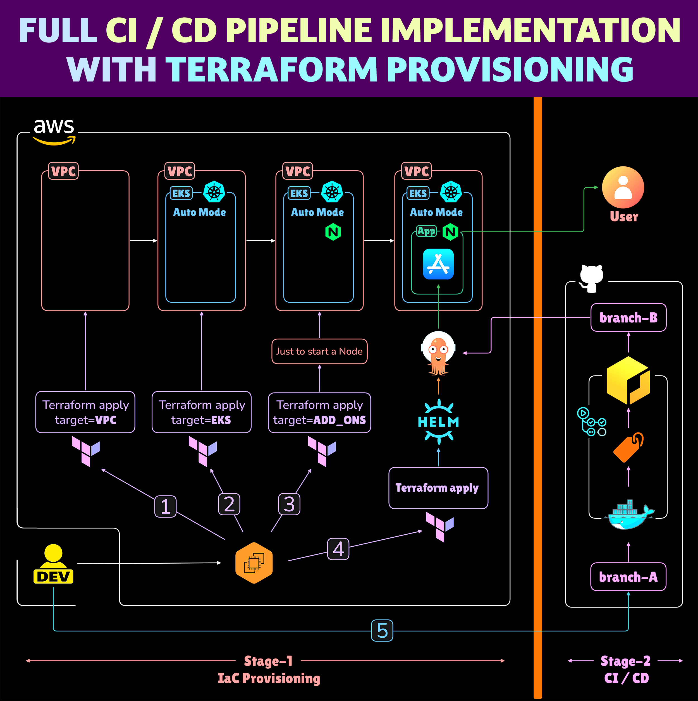
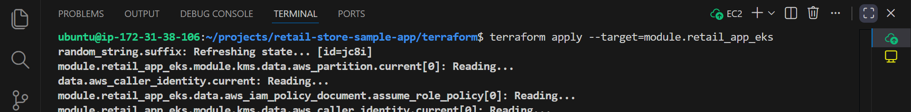
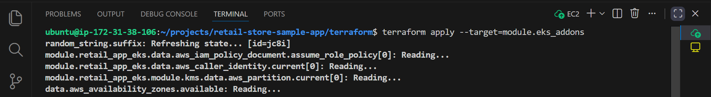
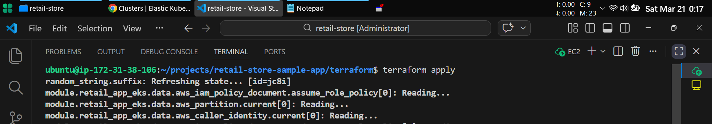
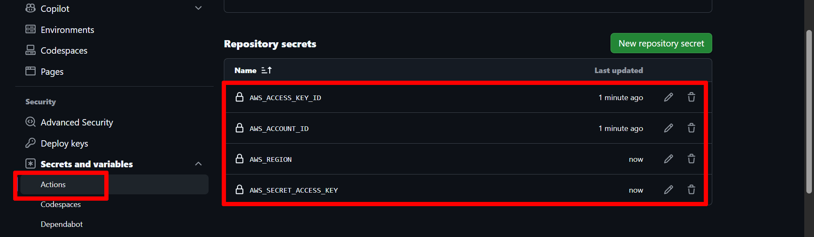
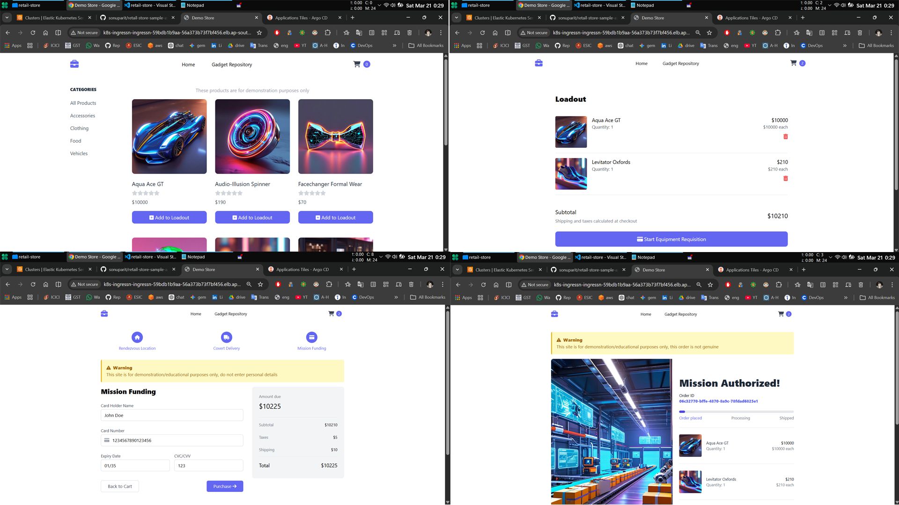
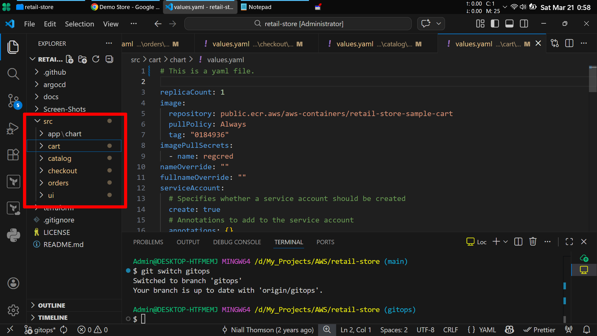
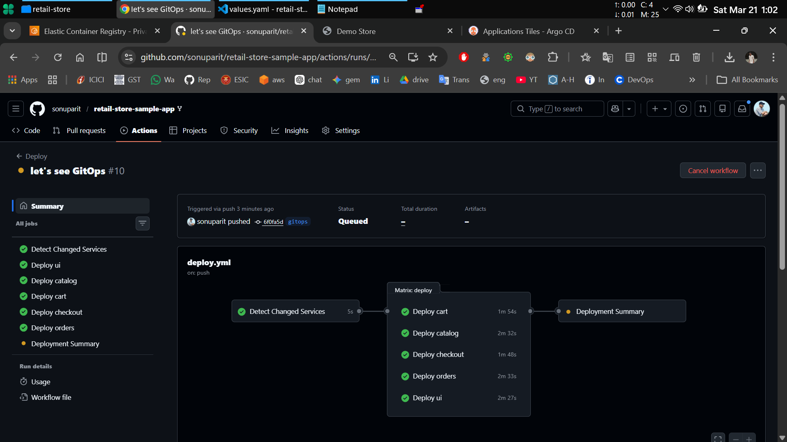

# 🚀 Reverse Engineering Terraform + GitOps Pipeline (EKS)

> [!NOTE]
> This project is based on an existing application that I reverse-engineered and enhanced — [original repo](https://github.com/aws-containers/retail-store-sample-app)

**1. Reverse-engineered and modularized the `Terraform`.**\
**2. Extended the system with GitOps based CI pipeline from scratch.**

### 🏗️ My Implementation

> Before implementing the system, I mapped out the full workflow to understand how each component interacts.

## 📚 Table of Contents

- **[Important Note](#️-important-note)**
- **[Overview](#-overview)**
- **[What I Did Differently](#-what-i-did-differently)**
- **[Architectural Decisions (ADR)](#-architectural-decisions-adr)**
- **[Core Implementation](#️-core-implementation)**
- **[Challenges & Solutions](#️-challenges--solutions)**
- **[Outcome](#-outcome)**
- **[Key Learnings](#-key-learnings)**
- **[Why This Project Is Important](#-why-this-project-is-important)**
- **[Ongoing Work & Roadmap](#-ongoing-work--roadmap-know-more)**
- **[About Me](#-about-me)**
- **[Acknowledgments](#-acknowledgments)**
- **[Screenshots](#-screenshots)**

## ⚠️ Important Note

This repository is based on:\
**AWS retail sample application [(original)](https://github.com/aws-containers/retail-store-sample-app)**

This work focuses on:

- **Reverse-engineering the Terraform setup** to understand how the infrastructure is actually built and behaves
- **Implementing a complete GitOps-based deployment workflow from scratch**

## 📝 Overview

*This project started from an existing AWS-based microservices setup.*

*Instead of just running it, I took it apart and rebuilt it in a way that helped me understand:*

- **How infrastructure is actually created under the hood**
- **How different components depend on each other**
- **How deployment really flows through CI/CD and GitOps**

I then extended the system by designing and implementing a **complete CI pipeline from scratch**, which was **missing in the original setup**.

## 🎯 What I Did Differently

**I treated it like a system to dissect and rebuild.**

- Broke down **Terraform into smaller modules** and applied them step-by-step
- Observed how each layer behaves (**VPC → EKS → Add-ons → ArgoCD**)
- Measured **delays, failures, and real-world behavior**
- **Built a CI pipeline myself** instead of relying on pre-built solutions
- Introduced controlled deployment using a **GitOps-based** workflow

## 🧠 Architectural Decisions (ADR)

### `ADR-01`: *Modular Terraform Instead of Single Apply*

Decision:\
**Break Terraform into multiple stages instead of one execution.**

Why:\
**To understand infrastructure behavior and improve debugging.**

Result:\
**Better visibility into dependencies and resource lifecycle.**

### `ADR-02`: *Separate Deployment Trigger Using GitOps Branch*

Decision:\
**Only trigger CI/CD when changes are pushed to *`gitops`* branch.**

Why:\
**To clearly separate development activity from deployment actions.**

Result:\
**More predictable and controlled release process.**

## ⚙️ Core Implementation

### 🔹 Terraform Reverse Engineering

**The original project used a single Terraform apply for everything.**

I restructured it into four logical stages:

- **VPC provisioning:**

    

- **EKS cluster setup**

    

- **Add-ons** installation (CertManager, Nginx)

    

- Application **deployment via ArgoCD**

    

Instead of applying everything at once, I applied each layer individually to:

- **Understand dependencies**
- Observe **resource creation** behavior
- **Debug issues** more effectively
- See how state evolves over time

This helped me move from “running Terraform” to actually **understanding** it.

### 🔹 CI Pipeline (Built from Scratch)

The original setup had **no CI**.

I *designed and implemented the full pipeline* using **GitHub Actions**:

- **Build Docker images:**

    

- **Tag images properly**
- **Authenticate securely with AWS:**

    

- **Push to Amazon ECR:**

    

Built **`step-by-step`** without relying on templates or copy-paste, **`focusing on understanding`** each component.

### 🔹 GitOps-Based Deployment Control

I introduced a **branch-based deployment** strategy:

- **`main`** → safe branch (**no deployment** trigger)  
- **`gitops`** → **triggers CI** pipeline and deployment

This separation ensures:

- Development work doesn’t accidentally deploy
- Deployment is intentional and controlled

## ⚔️ Challenges & Solutions

### 🏗️ Terraform

**🔹Challenge: Lack of visibility during execution**

- *Running **`terraform apply`** was provisioning everything, but I had no visibility into what was being created or in what order. It felt like things were happening behind the scenes without context.*

**🔹Solution:**

- *I broke the setup into smaller modules (**`VPC → EKS → Add-ons → App deployment`**) and applied them **`step-by-step`**. This made dependencies, resource creation, and execution flow much clearer.*

**🔹Challenge: Understanding resource dependencies**

- *It wasn’t obvious how different AWS resources were connected or why certain **`components were required before others`**.*

**🔹Solution:**

- *By applying **`Terraform in stages`** and observing the state after each step, I was able to **`map out the dependency chain`** and understand how the infrastructure is actually built.*

---

### 🔁 GitOps

GitOps took significantly more effort than I initially expected.

**🔹Challenge: Detecting changed services**

- *I needed the pipeline to rebuild only the services that actually changed, instead of rebuilding everything on every push.*

**🔹Solution:**

- *Implemented change detection using **`git diff`** and filtered changes based on service directories (src/<service>), reducing unnecessary builds.*

**🔹Challenge: Inefficient image builds**

- *Initially, I was building Docker images **`one-by-one`** for all services, which was slow and inefficient.*

**🔹Solution:**

- *Switched to a **`matrix-based strategy`** in GitHub Actions to build only changed services in parallel, improving speed and scalability.*

**🔹Challenge: ECR authentication and repository handling**

- *Faced issues with AWS authentication and pipeline failures when the ECR repository didn’t exist.*

**🔹Solution:**

- Configured secure AWS access using GitHub Secrets and added logic to create the ECR repository if it doesn’t exist, making deployments more reliable.

**🔹Challenge: CI and ArgoCD triggering conflicts**

- *Initially, ArgoCD was pointed to the **`entire repository`**, causing both CI and ArgoCD to react to the same changes and trigger simultaneously.*

**🔹Solution:**

- *Restricted ArgoCD to watch only the **`Helm chart path`**, creating a clear separation:*

  - CI → builds and updates images
  - ArgoCD → handles deployment

### 🔧 Additional Improvements

- Introduced **AWS KMS integration** to enable encryption for Kubernetes Secrets, ensuring sensitive data is securely stored in etcd  
- Added **Cert Manager** and **Nginx Ingress Controller** via Terraform add-ons  
- Implemented **retry logic for image push** to handle race conditions

---

### 💡 Reflection

*Each of these challenges helped me move from just **running tools to actually understanding** how the system behaves in real conditions.*

## 📊 Outcome

- Successfully **deployed the entire system** end-to-end
- Built a working **CI pipeline** from scratch
- Converted a monolithic **Terraform** setup into modular execution for better understanding
- Implemented controlled **GitOps-based deployment**
- Gained **real understanding** of infrastructure behavior (not just commands)

## 💡 Key Learnings

- **Terraform** becomes much clearer when **applied in stages** instead of all at once
- **Kubernetes** issues are often about **timing**, not errors
- **Building CI myself** taught me far more than using prebuilt pipelines
- Real understanding comes from **breaking systems**, not just running them

## 🔍 Why This Project Is Important

- Not a tutorial-based implementation
- **Reverse-engineered** an existing system instead of blindly using it
- **Added missing engineering pieces (CI pipeline)**
- Focused on **understanding system behavior**, not just success output
- **Includes real decisions, trade-offs, and observations**

## 🔭 Ongoing Work & Roadmap [(know more)](https://github.com/sonuparit/retail-store-reverse-engineered)

I’m currently **rebuilding this system end-to-end** to gain full control over every layer:

- **Source code understanding and restructuring**
- Containerization (**Docker**)
- **Helm chart design and customization**
- **Kubernetes deployment with persistent storage**
  - via **Helmfile**
  - via **ArgoCD**
- **CI/CD** pipelines
  - **GitHub Actions + ArgoCD**
  - **GitLab CI**
  - **Jenkins**
- **Notifications** and alerting
  - **Slack**
  - **Email**
- **Terraform from scratch** (fully custom implementation)
- **Observability and monitoring**
  - **Prometheus**
  - **Grafana**

👉 repo: **retail-store-reverse-engineered [(know more)](https://github.com/sonuparit/retail-store-reverse-engineered)**

## 🤵 About Me

**`Hi, I’m Sonu — a DevOps engineer`** focused on understanding systems deeply and building things that actually work in real conditions.

I like breaking complex setups into smaller parts, figuring out how they behave, and then rebuilding them in a more controlled way.

## 🙏 Acknowledgments

- **AWS Containers Team** for the original sample application
- **ArgoCD Community** for the excellent GitOps tooling
- **Terraform Community** for the AWS modules
- **GitHub Actions** for the CI/CD platform

## 📸 Screenshots

- **Applied Terraform in Modules:**

    

- **Application deployed successfully:**

    

- **Validated the full application:**

    

- **Made changes across all microservices and pushed to the `gitops` branch**

    

- **Validated CI trigger**

    

- **Validated ECR Uploads**

    

- **Validated ArgoCD sync**

    

- **Validated changed deployment**

    
