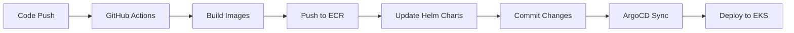

# Enf to End IaC Provisioning with full CI-CD GitOps pipeline


<div align="center">

[](Stars)


<strong>
<h2>AWS Containers Retail Sample - GitOps Edition</h2>
</strong>

**Modern microservices architecture deployed on AWS EKS using GitOps principles with automated CI/CD pipeline**

</div>

## Table of Contents

- [Quick Start](#-quick-start)
- [App ️Architecture](#-architecture)
- [️Infrastructure Architecture](#-infrastructure-architecture)
- [How to Run](#-how-to)
- [Prerequisites](#-prerequisites)
- [Installation](#-installation)
- [Cleanup](#-cleanup)
- [Troubleshooting](#-troubleshooting)

## Quick Start

**Deploy the complete retail store application!**

- **UI Service**: Java-based frontend
- **Catalog Service**: Go-based product catalog API
- **Cart Service**: Java-based shopping cart API
- **Orders Service**: Java-based order management API
- **Checkout Service**: Node.js-based checkout orchestration API

---

## Architecture

### **Application Architecture**


The retail store consists of 5 microservices working together:

| Service      | Language           | Purpose                | Port |
| ------------ | ------------------ | ---------------------- | ---- |
| **UI**       | Java (Spring Boot) | Web interface          | 8080 |
| **Catalog**  | Go                 | Product catalog API    | 8081 |
| **Cart**     | Java (Spring Boot) | Shopping cart API      | 8082 |
| **Orders**   | Java (Spring Boot) | Order management API   | 8083 |
| **Checkout** | Node.js (NestJS)   | Checkout orchestration | 8084 |

### **Infrastructure Architecture**


**🎯 What you get:**

- **Purpose**: Full production workflow with CI/CD pipeline
- **Images**: Private ECR (auto-updated with commit hashes)
- **Deployment**: Automated via GitHub Actions
- **Updates**: Automatic on code changes
- **Best for**: Production environments, automated workflows, enterprise deployments

### **GitOps Workflow**



## How to

### We will run everything from an EC2 instance and I will call it as (DevOps Machine)

- Fire up an EC2 instance

.png>)

- ssh into it and install all the prerequisites

### Prerequisites

- Tools required

| Tool          | Version | Installation                                                                         |
| ------------- | ------- | ------------------------------------------------------------------------------------ |
| **AWS CLI**   | v2+     | [Install Guide](https://docs.aws.amazon.com/cli/latest/userguide/install-cliv2.html) |
| **Terraform** | 1.0+    | [Install Guide](https://developer.hashicorp.com/terraform/install)                   |
| **kubectl**   | 1.33+   | [Install Guide](https://kubernetes.io/docs/tasks/tools/)                             |
| **Docker**    | 20.0+   | [Install Guide](https://docs.docker.com/get-docker/)                                 |
| **Helm**      | 3.0+    | [Install Guide](https://helm.sh/docs/intro/install/)                                 |
| **Git**       | 2.0+    | [Install Guide](https://git-scm.com/downloads)                                       |

- **AWS Account Requirement**  
with appropriate permissions

---

## 🔧 Installation

### **Step 1: Fork the Repository, then clone it**

```yml
git clone https://github.com/sonuparit/retail-store-sample-app.git
cd retail-store-sample-app/terraform
```
.png>)

### **Step 2: Configure AWS**

```yml
aws configure

# Verify configuration
aws sts get-caller-identity
aws eks list-clusters --region <your-region>
```

### Step 3: We will use `terraform` as IaC tool to build our platform

**1. initialize the terraform**

```yml
# initialze the terraform
terraform init
```
.png>)

- Wait for succesful initialization

.png>)

**2. Run terraform vpc module**

- Expected time to complete = 7-10 mins

```yml
terraform apply --target=module.vpc
```
This creates:

- ✅ VPC with public/private subnets
- ✅ EKS cluster with Auto Mode
- ✅ Security groups and IAM roles

.png>)

- We can now see in our AWS console we have our VPC

.png>)


**3. Run terraform eks module**

- Expected time to complete = 12-15 mins

```yml
terraform apply --target=module.retail_app_eks
```

.png>)

- We can now see in our AWS console we have our EKS Cluster

.png>)

- But notice we don't have any nodes, because we are using EKS auto mode, and the node will only be created when we deploy any app

.png>)

**4. Run terraform addons module**

```yml
terraform apply --target=module.eks_addons
```

.png>)

This creates:

- ✅ NGINX Ingress Controller
- ✅ Cert Manager for SSL

.png>)

- To view it on terminal we have to configure our kubectl to point to our cluster

**5. Run kubectl config command**

```yml
aws eks update-kubeconfig --region ap-south-1 --name <your-cluster-name>
```

.png>)

**6. Finally run terraform apply to deploy the app**

```yml
terraform apply
```
This deploys:

- ✅ ArgoCD for GitOps
- ✅ ArgoCD applications

.png>)

**7. Now get all the resources to see what we have achieved so far**

```yml
kubectl get all -A
```

.png>)

- we can see our app is not ready. It will take time because docker images are big

**8. Grab the loadbalancer url for our app**

- Copy the url to browser, it will not show our app because load balancer takes time to configure, and also our apps are not ready.

.png>)

**9.To see CD in action patch the service of ArgoCD Server as load balancer**

```yml
kubectl patch svc argocd-server -n argocd -p '{"spec": {"type": "LoadBalancer"}}'
```

.png>)

**10. Copy the loadbalancer url and paste it on your browser**

```yml
kubectl get svc -n argocd
```
.png>)

- It will take some time to open up in browser

**11. We need ArgoCD initial password to access it**

```yml
kubectl -n argocd get secret argocd-initial-admin-secret -o jsonpath="{.data.password}" | base64 -d; echo
```
.png>)

- Copy the password

**12. Open up ArgoCD loadbalancer, and login via `username = admin` and password**

.png>)

- Don't forget to change the password in `user info`

**13. We can see our apps are healthy**

.png>)

**14 We can verify in our terminal**

```yml
kubectl get pods -n retail-store
```
.png>)

**15. Access you app now**

.png>)

- You have successfully deployed a microservices app

**16. Go through your app**

.png>)

**17. Test the auto EKS Mode by terminating the EC2 instance**

.png>)

- AWS will auto run the next instance for your app

- Enjoy the app

### **Step 4: Now we perform CI via GitOps**

- When user push code in gitops branch, our CI pipeline will run and push the images to ECR

- For this we need an IAM user with ECR permission

- We give this user access to Github, so it can push our images to ECR

- And from ECR, ArgoCD will pull the images, and deploy it to our Cluster 

**18. Create an IAM user for gitops operation**

.png>)

**19. Attach ECR policies**

.png>)

**20. Create CLI access keys for the user and save it**

.png>)

- We also need `Account-ID` and `region` copy them and save them too.

**21. Go to your GitHub repository → Settings → Secrets and variables → Actions**

.png>)

- Add these secrets:

| Secret Name             | Description    | Example        |
| ----------------------- | -------------- | -------------- |
| `AWS_ACCESS_KEY_ID`     | AWS Access Key | `AKIA...`      |
| `AWS_SECRET_ACCESS_KEY` | AWS Secret Key | `wJalrXUt...`  |
| `AWS_REGION`            | AWS Region     | `us-west-2`    |
| `AWS_ACCOUNT_ID`        | AWS Account ID | `123456789012` |

---

.png>)

*[Note!] You might not see Actions tab in your github repository, because by default GitHub looks into main branch. But that's not an issue, when we push our code in gitops branch, workflows will auto run.*

**22. Colne the repo to your local machine and switch to gitops branch**

- You can also perfrom this action on your cloud machine

.png>)

**23. Make changes into your src file for every service**

.png>)

.png>)

**24. Push the changes to github**

.png>)

**25. Go to your github repo, and there we have Actions tab (Open it)**

- We can see our CI has triggered 

.png>)

- Once it's done

**26. Go to your ECR console, we can see, we have 5 images**

.png>)

**27. Now we need to change our ArgoCD config to look at our gitops branch**

- Go to your DevOps machine change the directory to:

```yml
cd retail-store-sample-app/argocd/applications
```

- Apply the yml files from gitops branch

```yml
kubectly apply -f . -n argocd
```

.png>)

**28. Once applied we can see our ArgoCD has started our CD phase**

.png>)

**29. We can verify that in our terminal**

.png>)

**30. Once sync is complete, open your app**

.png>)

- We can see our changes in the browser


### Congratulations you have successfully completed full CI-CD with IaC Provisioning

## Cleanup

```yml
cd terraform/

# Option 1: Destroy everything at once
terraform destroy --auto-approve
```
- We can see distruction has started

.png>)

- Our cluster is deleting

.png>)

### Remove all the repositories from ECR

.png>)

### **Remove GitHub Secrets**

1. Go to GitHub repository → **Settings** → **Secrets and variables** → **Actions**
2. Delete all AWS-related secrets

.png>)

### Once distruction Completed

.png>)

### Turn off your DevOps machine

.png>)

.png>)

## 🔧 Troubleshooting

### **Useful Commands**

```yml
# Get cluster info
kubectl cluster-info

# Check nodes
kubectl get nodes

# Check all namespaces
kubectl get pods -A

# Check logs
kubectl logs -n retail-store deployment/ui

# Check events
kubectl get events -n retail-store
```

---

### **Debug Commands**

```yml
# Check all resources
kubectl get all -A

# Check events across all namespaces
kubectl get events --sort-by='.lastTimestamp'

# Check ArgoCD logs
kubectl logs -n argocd deployment/argocd-server
kubectl logs -n argocd deployment/argocd-application-controller

# Check ingress controller logs
kubectl logs -n ingress-nginx deployment/ingress-nginx-controller

# Check application logs
kubectl logs -n retail-store deployment/ui
kubectl logs -n retail-store deployment/catalog
```

---

## 🤝 Contributing

1. Fork the repository
2. Create a feature branch
3. Commit your changes
4. Push to the branch
5. Open a Pull Request

---

## License

This project is licensed under the Apache License 2.0 - see the [LICENSE](./LICENSE) file for details.

---

## 🙏 Acknowledgments

- **AWS Containers Team** for the original sample application
- **ArgoCD Community** for the excellent GitOps tooling
- **Terraform Community** for the AWS modules
- **GitHub Actions** for the CI/CD platform

---

<div align="center">

**⭐ Star this repository if you found it helpful!**

</div>

