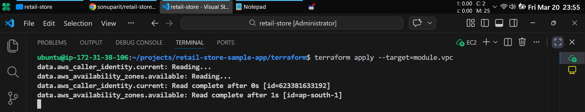
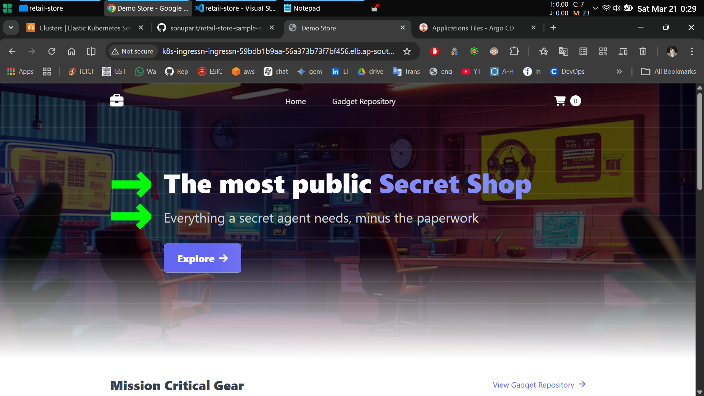
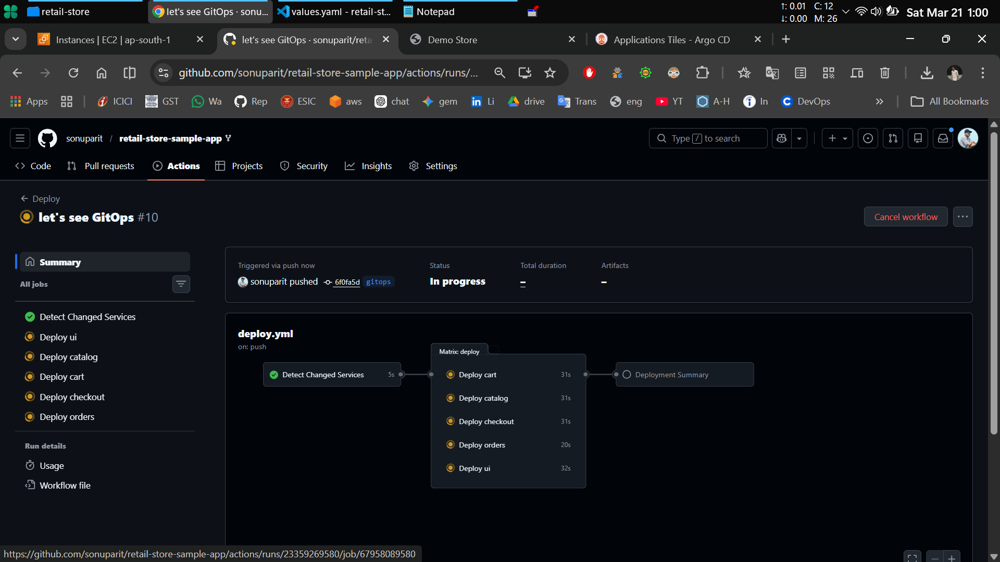
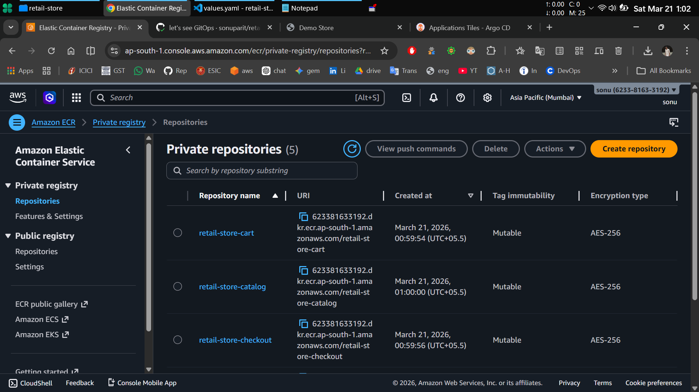
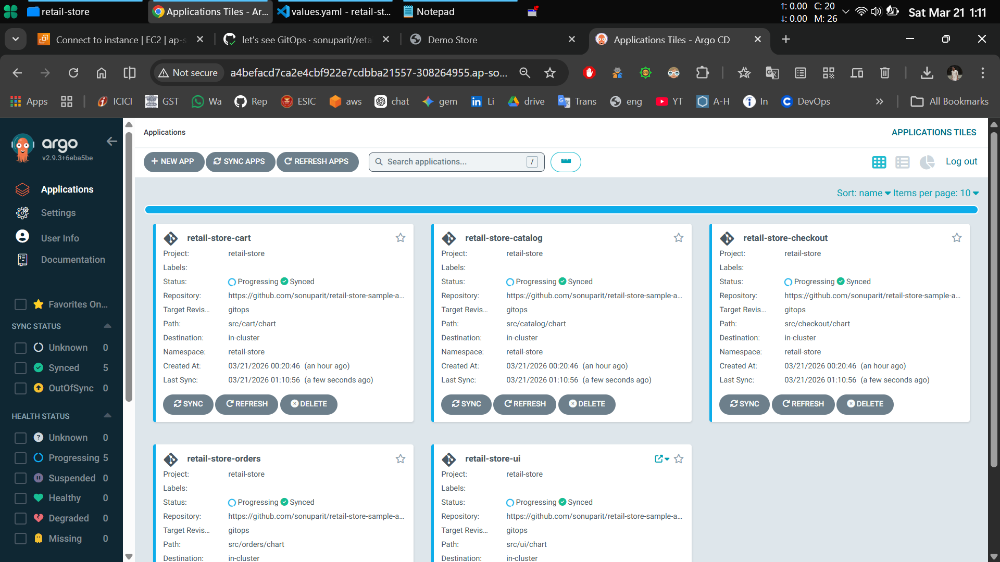

# 🚀 End-to-End IaC + GitOps Pipeline (EKS)
**Understanding how real DevOps systems behave — not just how to run them.**

> [!NOTE]  
> **Learning-focused repository**\
> This project is built to deeply understand how a production-grade DevOps system works end-to-end using AWS, Terraform, CI/CD, and GitOps principles.

## 📚 Table of Contents

- [Overview](#-overview)
- [What I Focused On](#-what-i-focused-on)
- [Key Concepts Explored](#-key-concepts-explored)
- [What I Actually Did](#-what-i-actually-did)
- [Outcome](#-outcome)
- [Important Note](#️-important-note)
- [GitOps Workflow & System Architecture](#️-gitops-workflow--system-architecture)
- [Execution](#-execution)
- [Screenshots](#-screenshots)
- [Key Takeaway](#-key-takeaway)
- [Author](#-author)
- [Acknowledgments](#-acknowledgments)

## 📝 Overview

*This repository captures my hands-on exploration of building a complete DevOps workflow:*

- Infrastructure provisioning using Terraform
- Kubernetes cluster setup on AWS EKS
- CI pipeline using GitHub Actions
- GitOps-based CD using ArgoCD

Instead of treating this as a “setup guide”, I approached it as a **system to understand and break down.**

## 🎯 What I Focused On

Rather than just deploying the application, I focused on understanding:

- **How infrastructure components are provisioned and connected**
- How **CI pipelines build and push artifacts (ECR)**
- How **GitOps controls deployment state via ArgoCD**
- How **services interact inside a Kubernetes** cluster
- What happens **during failures, delays, and retries**

## 🧭 Key Concepts Explored

- Infrastructure as Code **(IaC) using Terraform** (modular provisioning)
- **EKS Architecture** and managed node behavior
- GitHub Actions CI pipeline **(build → tag → push images)**
- **Amazon ECR integration** for container registry
- ArgoCD GitOps workflow **(desired state → sync → deployment)**
- Kubernetes **debugging & observability** basics

## 🕵 What I Actually Did

- **Broke down Terraform execution into targeted modules** (VPC, EKS, addons)
- **Configured AWS authentication** and secure access for CI pipelines
- **Integrated GitHub Actions with ECR using IAM credentials**
- **Observed ArgoCD sync behavior** and deployment lifecycle
- Debugged real-world issues like:
    - **LoadBalancer delays**
    - **Pod startup time**
    - **Service exposure**

## 📊 Outcome
- Built a clear **understanding of end-to-end DevOps workflow**
- Gained confidence in **working with multi-component cloud systems**
- Learned how **CI/CD and GitOps** integrate in real deployments

## ⚠️ Important Note

This repository uses the AWS retail sample application.

*The goal was not to build the application, but to understand and implement the infrastructure and deployment workflow around it.*

I am currently applying these learnings in my own implementation:\
👉 **retail-store-reverse-engineered [(know more)](https://github.com/sonuparit/retail-store-reverse-engineered)**

## 🏗️ GitOps Workflow & System Architecture

## ⚙️ Execution

**To validate my understanding, I independently deployed the complete system end-to-end:**

- Provisioned infrastructure using **Terraform**
- Deployed **EKS cluster** and addons
- Configured CI pipeline **(GitHub Actions → ECR)**
- Deployed applications using **ArgoCD (GitOps)**

**Key verification:**

- All services **running successfully** in cluster
- **ArgoCD sync** working as expected
- **LoadBalancer** exposed application
- **CI pipeline** building and pushing images correctly

## 📸 Screenshots

## 💡 Key Takeaway

I believe DevOps is not about tools — **it’s about understanding how systems behave.**

This project helped me move from:

**“Running commands”**\
to\
**“Understanding what’s happening behind the scenes”**

## 🤵 Author

**`Hi, I’m Sonu — a DevOps Engineer`** focused on building practical, real-world systems.

I like breaking down complex workflows and turning them into simple, working solutions. Currently, **I’m reverse-engineering this system end-to-end — from source code to Kubernetes, CI/CD, and cloud-native infrastructure.** [(follow here)](https://github.com/sonuparit/retail-store-reverse-engineered)

## 🙏 Acknowledgments

- **AWS Containers Team** for the original sample application
- **ArgoCD Community** for the excellent GitOps tooling
- **Terraform Community** for the AWS modules
- **GitHub Actions** for the CI/CD platform